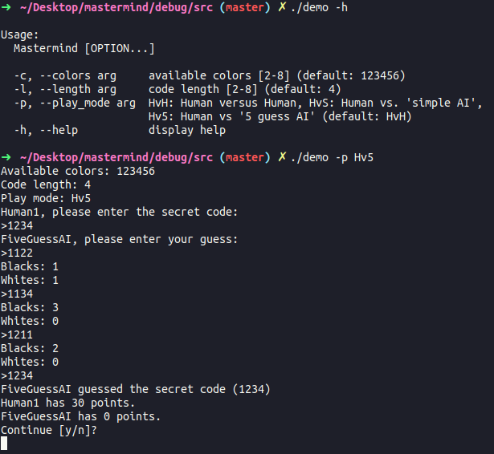

# Mastermind
C++ implementation based on the [Mastermind wiki](https://en.wikipedia.org/wiki/Mastermind_(board_game))

## Build instructions
```bash
mkdir build && cd build
cmake ..
make
```
## Program structure
 The game runs as a simple state machine with four states, as seen in the following diagram
 

## Create your own player
You can create your own player by subclassing MastermindPlayer and implement the two functions ```makeGuess()``` and ```makeCode()```. I have provided three examples
* FiveGuessAI
	* Uses [Knuth's min max algorithm](https://en.wikipedia.org/wiki/Mastermind_(board_game)#Best_strategies_with_four_pegs_and_six_colors). Pretty poorly optimized, and is very with when there are 6 or more possible colors. Possible improvements: parellization of ```getOptimalGuess()```. Prune ```possible_guesses_``` - currently every combination is checked towards the ```active_set``` every time a guess is made.
* SimpleAI
	* Operates like Knuth's algorithm, except it does not apply min maxing. Simply removes any guess from the active set, which do not correspond to the received result.
* HumanPlayer
	* You make the guesses using stdin.
 